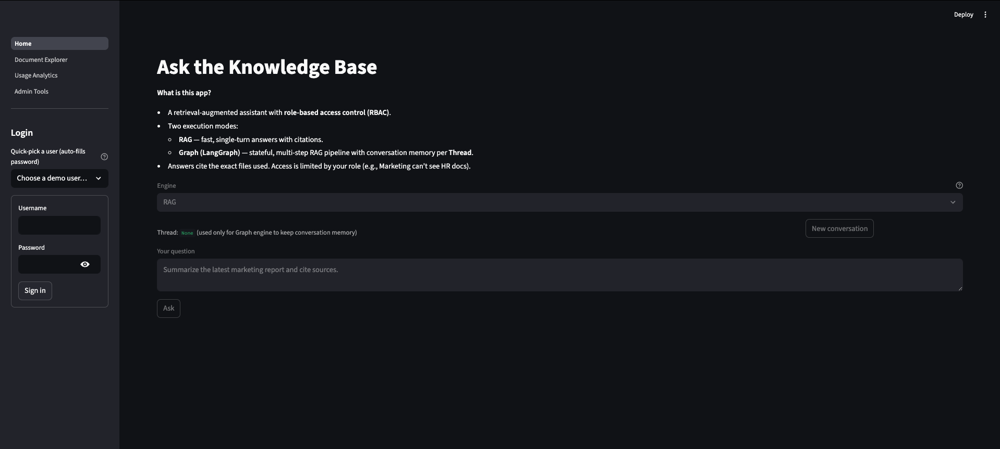
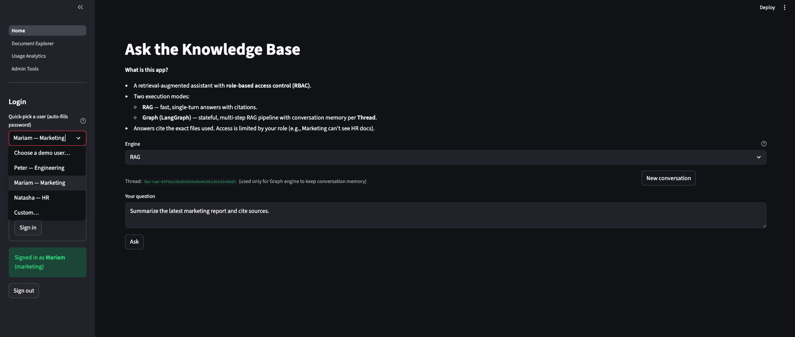
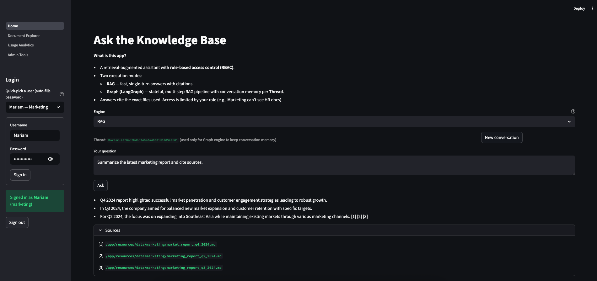
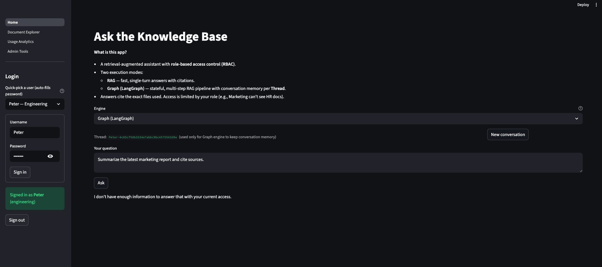
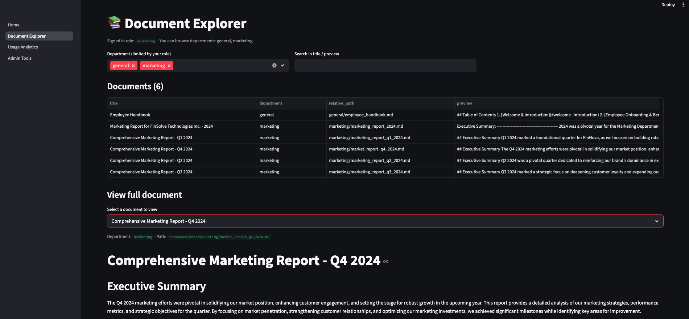
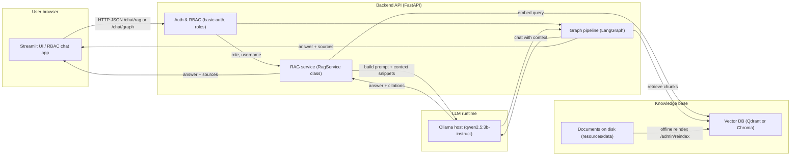
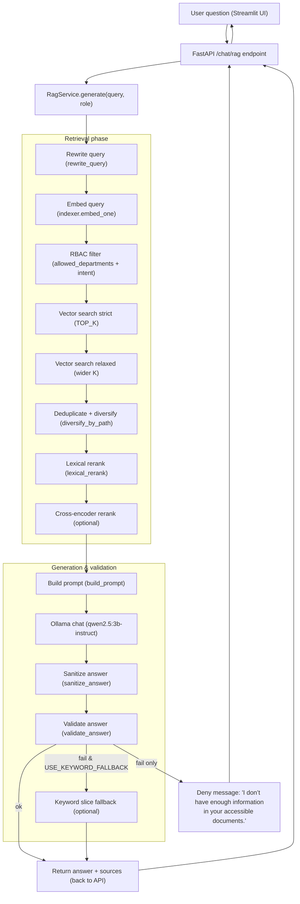

# RBAC-RAG Assistant

> A retrieval-augmented assistant with **role-based access control (RBAC)** for internal knowledge bases.  
> Streamlit UI · FastAPI backend · Qdrant vector DB · Ollama-hosted LLM

  

---

## 1. What is this?

RBAC-RAG Assistant is a small end-to-end demo of how to build a **secure internal chatbot**:

- Answers questions strictly from your documents (no internet access).
- Enforces **department-level permissions** (e.g., Engineering vs HR vs Marketing).
- Supports both:
  - **RAG** – single-shot retrieval + generation.
  - **Graph (LangGraph)** – multi-step pipeline with conversation memory.

### Design goals

This project is intentionally:

- **Realistic enough for learners**  
  It shows a complete RBAC-aware RAG stack: Streamlit UI, FastAPI backend, vector DB (Qdrant/Chroma), LLM via Ollama, indexing pipeline, and role-based access controls + evals.

- **Small enough to run on a laptop**  
  Everything is containerized and tuned so it can run on a single developer machine (or a tiny VM) with Docker, without requiring paid cloud services or massive GPUs.

---

## 2. Screenshots

**Login + Role selection**

  

**RAG Answer view**

  

**Graph (LangGraph) Denial**

  

**Document Explorer**

  

---

## 3. Features

- 🧑‍💼 **Role-based answering**
  - Users authenticate with a pre-configured role (Engineering, Finance, HR, Marketing, General).
  - The assistant only retrieves from documents they are allowed to see.

- 📚 **Private retrieval-augmented generation (RAG)**
  - Markdown documents stored under `resources/data/<department>/`.
  - Vector search via **Qdrant** (or Chroma, depending on config).
  - Answers always include **source file paths**.

- 🧠 **Two execution engines**
  - **RAG** – fast, stateless, single-turn answers.
  - **Graph** – LangGraph-based multi-step pipeline with retrieval, reranking, passage selection, and validation.

- 🔍 **LLM-assisted passage selection (optional)**
  - Model picks the top-K passages from retrieved hits, reducing context size.

- 🛡️ **Safety & RBAC intent detection**
  - Simple heuristic to infer which department(s) a question is about.
  - Hard or soft deny depending on config (`RBAC_INTENT` / `RBAC_INTENT_SOFT`).

- 🗂️ **Document Explorer**
  - Browse indexed documents and their department tags.
  - Helpful for **answer verification** during demos.

- 📊 **Usage analytics (lightweight)**
  - Track basic stats (e.g., number of questions, engine used, answer length).

- 🛠 **Admin tools**
  - Trigger **re-indexing** from the UI after adding or editing documents.
  - View which vector backend and model are currently in use.

---

## 4. High-level system architecture (Streamlit + API + LLM + Vector DB)

## 4.1  Inside the RAG pipeline

---

## 5. Roadmap / Ideas

- ✅ Initial RAG + LangGraph pipeline with RBAC.
- ✅ Document explorer & admin reindex.
- ⏳ Better analytics (per-user, per-department).
- ⏳ More granular RBAC (document-level ACLs).
- ⏳ Optional hosted LLM fallback (OpenAI / HF Inference) with cost controls.
- ⏳ CI pipeline (tests + linting) via GitHub Actions.

---

## Demo

> If you’d like a live walkthrough or a short video demo, reach out:
> [goofosuosei@gmail.com](mailto:goofosuosei@gmail.com)