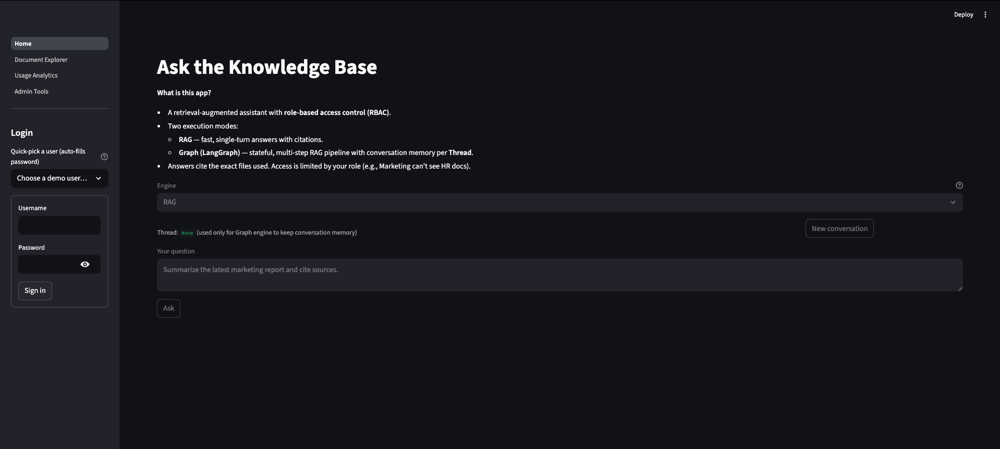
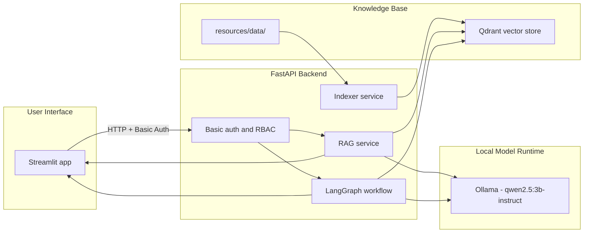
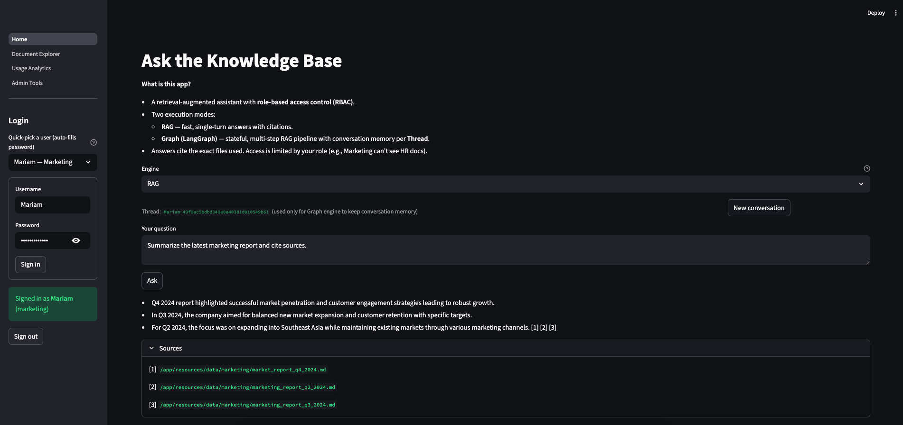
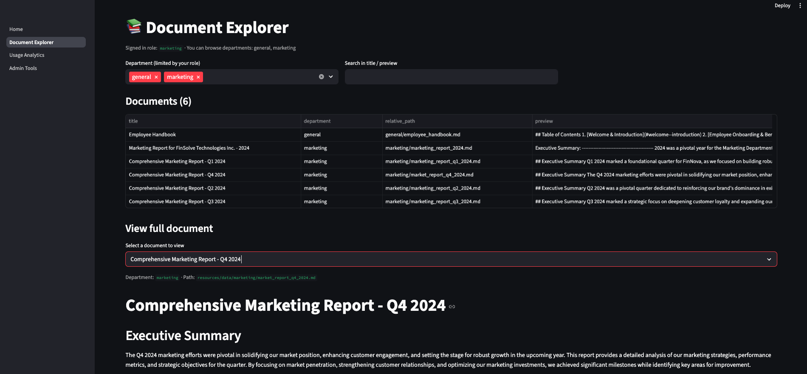

# RBAC-RAG Assistant

RBAC-RAG Assistant is a local-first retrieval-augmented generation application for internal knowledge bases. It combines role-based access control, document retrieval, source citations, and local LLM inference to demonstrate how an organization can expose private documents through a controlled assistant experience.

The stack uses Streamlit for the user interface, FastAPI for the backend API, Qdrant for vector search, sentence-transformers for local embeddings, LangGraph for the optional graph workflow, and Ollama for local chat completion.

<p align="center">
  
</p>

## Highlights

- Role-scoped document retrieval across Engineering, Finance, HR, Marketing, General, and executive access levels.
- RAG and LangGraph execution modes with source citations.
- Local LLM runtime through Ollama, with no hosted LLM required by default.
- Qdrant-backed semantic search with optional Chroma support.
- Document explorer filtered by the signed-in user's role.
- Admin reindex action for Engineering and C-level users.
- Session-local usage analytics for demo and evaluation workflows.
- Evaluation fixtures for correctness and RBAC leakage checks.

## Architecture


```mermaid
flowchart LR
  subgraph UI["User Interface"]
    Streamlit["Streamlit app"]
  end

  subgraph API["FastAPI Backend"]
    Auth["Basic auth and RBAC"]
    Rag["RAG service"]
    Graph["LangGraph workflow"]
    Indexer["Indexer service"]
  end

  subgraph Data["Knowledge Base"]
    Docs["resources/data/<department>"]
    Qdrant["Qdrant vector store"]
  end

  subgraph LLM["Local Model Runtime"]
    Ollama["Ollama - qwen2.5:3b-instruct"]
  end

  Streamlit -->|"HTTP + Basic Auth"| Auth
  Auth --> Rag
  Auth --> Graph
  Docs --> Indexer
  Indexer --> Qdrant
  Rag --> Qdrant
  Graph --> Qdrant
  Rag --> Ollama
  Graph --> Ollama
  Rag --> Streamlit
  Graph --> Streamlit
```

## Repository Layout

```text
.
|-- app/
|   |-- graph/              # LangGraph RAG workflow
|   |-- services/           # Auth, indexing, retrieval, generation helpers
|   |-- schemas/            # Pydantic models
|   |-- utils/              # File reading and chunking utilities
|   |-- main.py             # FastAPI application
|   `-- policy.py           # Role-to-department access policy
|-- docs/                   # Screenshots
|-- evals/                  # Evaluation cases
|-- pages/                  # Streamlit multipage views
|-- resources/data/         # Sample department documents
|-- scripts/                # CLI utilities
|-- tests/                  # RBAC and evaluation tests
|-- Home.py                 # Streamlit entrypoint
|-- docker-compose.yml      # Qdrant, Ollama, API, and web services
`-- requirements*.txt       # Runtime and development dependencies
```

## Quick Start

### Prerequisites

- Docker Desktop
- Python 3.10 or newer for local development
- At least several GB of free disk space for model and embedding dependencies

### 1. Configure Environment

```bash
cp .env.example .env
```

The defaults use:

- `VECTOR_DB=qdrant`
- `EMBED_BACKEND=local`
- `ST_MODEL=sentence-transformers/all-MiniLM-L6-v2`
- `OLLAMA_MODEL=qwen2.5:3b-instruct`

### 2. Start Infrastructure

```bash
docker compose up -d qdrant ollama
docker compose exec ollama ollama pull qwen2.5:3b-instruct
```

### 3. Run the Full Docker Stack

```bash
docker compose up --build api web
```

Open the application at:

- Streamlit UI: <http://localhost:8501>
- FastAPI backend: <http://localhost:8000>
- API health check: <http://localhost:8000/healthz>

### 4. Local Development Mode

For faster iteration, run Qdrant and Ollama in Docker and run the API/UI from the local virtual environment:

```bash
python -m venv .venv
source .venv/bin/activate
pip install -r requirements.dev.txt

docker compose up -d qdrant ollama
docker compose exec ollama ollama pull qwen2.5:3b-instruct

PYTHONPATH=. \
VECTOR_DB=qdrant \
QDRANT_URL=http://localhost:6333 \
OLLAMA_HOST=http://localhost:11434 \
DATA_DIR=resources/data \
python scripts/cli.py ingest
```

Start the API:

```bash
PYTHONPATH=. \
VECTOR_DB=qdrant \
QDRANT_URL=http://localhost:6333 \
OLLAMA_HOST=http://localhost:11434 \
DATA_DIR=resources/data \
AUTO_INDEX=0 \
uvicorn app.main:app --host 127.0.0.1 --port 8000
```

Start the UI in a second terminal:

```bash
PYTHONPATH=. \
API_URL=http://127.0.0.1:8000 \
streamlit run Home.py --server.port=8501 --server.address=127.0.0.1
```

## Demo Users

The project ships with local demo users for role-based testing:

| Username | Password | Role |
| --- | --- | --- |
| `Peter` | `pete123` | Engineering |
| `Mariam` | `mariampass123` | Marketing |
| `Natasha` | `hrpass123` | HR |
| `Sam` | `financepass` | Finance |
| `Cathy` | `cathyceo` | C-level |
| `Emma` | `password` | Employee |

These credentials are for local demonstration only. Replace them with `BASIC_USERS_JSON` or a production identity provider before using this pattern beyond a demo environment.

## Application Views

### Chat

The main chat screen supports both RAG and Graph execution modes, displays generated answers, and shows source files used for retrieval.

<p align="center">
  
</p>

### Document Explorer

The document explorer shows only documents visible to the current role and allows simple filtering by department and text search.

<p align="center">
  
</p>

### Admin Tools

Engineering and C-level users can trigger reindexing from the UI. The page also shows API health and runtime model/vector-store settings.

### Usage Analytics

The analytics page tracks session-local request counts, engine usage, request status, latency, answer length, and source count. It is intended for local demos and lightweight validation, not durable production reporting.

## API Endpoints

| Method | Path | Description |
| --- | --- | --- |
| `GET` | `/healthz` | Basic service health check |
| `GET` | `/version` | Runtime model and vector database settings |
| `GET` | `/login` | Validate Basic Auth credentials |
| `POST` | `/chat/rag` | Single-turn RAG answer generation |
| `POST` | `/chat/graph` | LangGraph answer generation with thread memory |
| `POST` | `/admin/reindex` | Rebuild vector index from `resources/data` |

Example RAG request:

```bash
curl -u Peter:pete123 \
  -H "Content-Type: application/json" \
  -d '{"message":"What are the key components of the engineering architecture?"}' \
  http://localhost:8000/chat/rag
```

## Data Model and Access Control

Documents are organized by department:

```text
resources/data/
|-- engineering/
|-- finance/
|-- general/
|-- hr/
`-- marketing/
```

The access policy is defined in `app/policy.py`. Each role maps to an allowed set of departments. Retrieval filters enforce the role boundary before answers are generated, and intent detection can deny or soften requests that appear to target departments outside the user's access.

## Configuration

Most runtime behavior is controlled through `.env`.

| Variable | Purpose |
| --- | --- |
| `VECTOR_DB` | Vector backend: `qdrant` or `chroma` |
| `QDRANT_URL` | Qdrant endpoint used by the API |
| `DATA_DIR` | Document root used during indexing |
| `EMBED_BACKEND` | Embedding provider: `local` or `openai` |
| `ST_MODEL` | Local sentence-transformer model |
| `OLLAMA_HOST` | Ollama server URL |
| `OLLAMA_MODEL` | Chat model used for answer generation |
| `AUTO_INDEX` | Reindex once on API startup when set to `1` |
| `RBAC_INTENT` | Enable department intent detection |
| `RBAC_INTENT_SOFT` | Soften cross-department intent to allowed/general docs |
| `RERANK_CE` | Enable optional cross-encoder reranking |
| `PASSAGE_SELECTION` | Enable optional LLM passage selection |

See `.env.example` for the full set of supported settings.

## Testing

Install development dependencies:

```bash
pip install -r requirements.dev.txt
```

Run the test suite:

```bash
pytest -q
```

The tests cover RBAC leakage scenarios and evaluation cases under `evals/`. Some tests require the embedding model and vector index to be available.

## Operational Notes

- The first local run may download the embedding model from Hugging Face and the chat model from Ollama.
- Docker Compose persists Qdrant, Ollama, and Hugging Face cache data in named volumes.
- The checked-in documents are synthetic sample data for demonstration and evaluation.
- Demo authentication uses plaintext credentials and should not be used as-is in production.
- For production use, add durable auth, encrypted secrets management, persistent analytics, monitoring, and document-level ACLs.

## Roadmap

- Document-level access control.
- Durable analytics and audit logging.
- CI workflow for tests and linting.
- Optional hosted LLM and embedding providers.
- Additional evaluation coverage for retrieval quality and access-boundary behavior.
